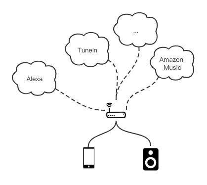

Linkplay Music Kit
=================
Linkplay Music Kit是Linkplay Home Audio方案的app端SDK；通过它，您可以快速的将我们的解决方案实现到您的产品里。

MusicKit主要解决了两方面的问题：
1. 维护与固件的通讯协议，使您可以简洁的与设备进行交互而不必关心琐碎的通讯技术问题
2. 封装了网络服务（音乐服务、智能语音服务等）的复杂度，使您可以快速接入它们而不必关心实现细节

而从流程的维度讲，用户将产品带回家之后可以做如下归结：

# OOBE
Out-of-box experience，用户首次将产品买回家之后的开箱流程。这个流程的体验需要尽可能简单与健壮。
可以看到，设置的流程是由下网上，由硬件向软件，由底层服务向高层服务的：

| 步骤                    | 分层                                                  |
| :--------               | :---------------------------------------------------- |
| Wi-Fi Setup             | 链路层                                                |
| First OTA               | 固件系统                                              |
| Initial Device Settings | 系统软件设置，例如时区、语言等                        |
| Service Setup           | 应用层服务设置，各种软件服务的设置                    |

- Wi-Fi Setup

  第一步是将设备连接到互联网上。目前我们提供了如下配网方式，请根据自己的情况选择：

| 名称                                            | 说明                                                  |
| :--------                                       | :---------------------------------------------------- |
| [BLE配网](./iOS/DeviceSetup.md#ble-配网模式)    | 如果您的模组有BLE模块，则可以使用此种配网方式         |
| [直连配网](./iOS/DeviceSetup.md#wi-fi-配网模式) | 如果您的模组没有BLE模块，可以使用此种方式             |

- [First OTA](./iOS/Device.md#固件升级)

  用户将产品买回家的时候，距离产品量产可能已经有了新的OTA版本。为了能提供给用户最好的产品服务，第一次OTA检测是必须的。

- Initial Device Settings

  当硬件、固件都处于最新状态之后，就需要给设备进行一些本地化、个性化设置了，这包括：
  - 语言
  - 时区
  - 静默升级时间段
  
- Service Setup

  再之后，就需要提供之上的应用层服务了：
  - 音乐服务，例如 Tunein, Amazon Music
  - 语音服务，例如 [Alexa](./iOS/Alexa.md)
  
这样，OOBE的流程就结束了，用户可以开始设备的使用。

# 设备发现

设备发现是设备控制的前提：[Device Discover](./iOS/Device_SDK.md)

在我们的方案中，设备发现主要基于目前最流行的两个局域网设备发现协议：
- [mDNS](https://tools.ietf.org/html/rfc6762)
- [SSDP](https://openconnectivity.org/upnp-specs/UPnP-arch-DeviceArchitecture-v2.0-20200417.pdf)

以此来提高设备发现的稳定性。

# 设备交互
## 播放控制 ##

[播放控制](./iOS/MusicSetting.html)是该方案的主要能力。

## 其他功能 ##

- 闹钟
- 预置
- OTA

# 音源接入

我们已经为您集成了很多流行的音源，包括但不限于：
- Amazon Music
- TuneIn
- iHeartRadio

请与您的接口人联系获得对应的SDK以及文档。
