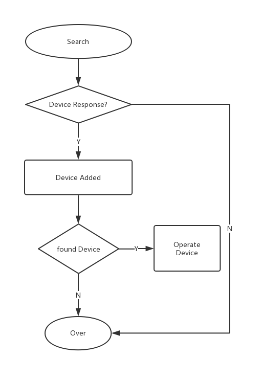

# Device Discover

# Overview 

This sdk implements the functions that discover devices in the same LAN, includes device online/offline, get device object through device uuid and so on.




# API Reference 

### Device Discover

#### Init
- Description

Init function

    ``` Java
    init(LPDeviceManagerParam param)
    ```

- Parameter

| Name      | Type                     | Description                                           |
| :-------- | :----------------------- | :---------------------------------------------------- |
| param     | String                   | Required information, such as context                 |

- Return

    N/A

- Sample Code

    ``` Java
    LPDeviceManagerParam param = new LPDeviceManagerParam();
    param.context = context;//application context

    LPDeviceManager lpDeviceManager = LPDeviceManager.getInstance();
    lpDeviceManager.init(param);
    ```

#### Device Discover
- Description

    Search devices in the same LAN
    
    ``` Java
    search(String[] key)
    ```

- Parameter

| Name      | Type                     | Description                                               |
| :-------- | :----------------------- | :----------------------------------------------------     |
| key       | String                 | The key to search device, you can ignore this by default. |

- Response

    N/A

- Sample Code

    ``` Java
    LPDeviceManager lpDeviceManager = LPDeviceManager.getInstance();
    lpDeviceManager.init(param);
    lpDeviceManager.addObserver(this);
//        lpDeviceManager.search(new String[]{"xxxxxxx"});//custom search key
    lpDeviceManager.search(null);
    ```

#### Stop Search

- Description

    ``` Java
    stop()
    ```

- Parameter

    N/A

- Sample Code

    ``` Java
    @Override
   public void onTerminate() {
       super.onTerminate();
       LPDeviceManager.getInstance().stop();
   }
    ```

### Observer

#### Add Observer

- Description

    ``` Java
    addObserver(LPDeviceManagerObserver observer)
    ```

- Parameter

| Name     | Type                    | Description                                          |
| -------- | ----------------------- | ---------------------------------------------------- |
| observer | LPDeviceManagerObserver | The observer to receive online/offline notify        |

- Response

    N/A

- Sample Code

    ``` Java
    LPDeviceManager lpDeviceManager = LPDeviceManager.getInstance();
    lpDeviceManager.init(param);
    lpDeviceManager.addObserver(this);
//        lpDeviceManager.search(new String[]{"xxxxxxx"});//custom search key
    lpDeviceManager.search(null);
    ```

#### Remove Observer

- Description

    ``` Java
    removeObserver()
    ```

- Parameter

| Name     | Type                    | Description                                    |
| -------- | ----------------------- | ---------------------------------------------- |
| observer | LPDeviceManagerObserver | The observer to receive online/offline notify  |

- Response

    N/A

- Sample Code

    ``` Java
    @Override
   public void onTerminate() {
       super.onTerminate();
 
       LPDeviceManager.getInstance().stop();
       LPDeviceManager.getInstance().removeObserver();
   }
    ```

### Get Device

#### Get Device with UUID

- Description

    ``` Java
    deviceForID(String UUID)
    ```

- Parameter

| Name      | Type                     | Description                                     |
| :-------- | :----------------------- | :---------------------------------------------- |
| UUID      | String                 | Device UUID                                     |

- Response

| Type               | Description                              |
| :----------------- | :--------------------------------------- |
| LPDevice           | Device object                            |


- Sample Code

    ``` Java
    LPDevice lpDevice = LPDeviceManager.getInstance().deviceForID(UUID);
    ```

#### Get Device List

- Description

    ``` Java
    getMasterDevices()
    ```
- Parameter

    N/A

- Response

| Type               | Description                              |
| :----------------- | :--------------------------------------- |
| List<LPDevice>     | Device list                              |

- Sample Code

    ``` Java
    List<LPDevice> deviceList = LPDeviceManager.getInstance().getMasterDevices();
    ```

#### Get Device with IP

- Description

    ``` Java
    deviceForIP(String IP)
    ```

- Parameter

| Name      | Type                     | Description                                     |
| :-------- | :----------------------- | :---------------------------------------------- |
| IP        | String                 | Device IP                                       |

- Response

| Type               | Description                              |
| :----------------- | :--------------------------------------- |
| LPDevice           | Device object                            |


- Sample Code

    ``` Java
    LPDevice device = LPDeviceManager.getInstance().deviceForIP(ip);
    ```

#### Get Device with MAC

- Description

    ``` Java
    deviceForMac(String MAC)
    ```

- Parameter

| Name      | Type                     | Description                                     |
| :-------- | :----------------------- | :---------------------------------------------- |
| MAC       | String                 | Device MAC                                      |


- Response

| Type               | Description                              |
| :----------------- | :--------------------------------------- |
| LPDevice           | Device object                            |

- Sample Code

    ``` Java
    LPDevice device = LPDeviceManager.getInstance().deviceForMac(MAC);
    ```

#### Get Slave Devices with Master UUID

- Description

    ``` Java
    getSlaveDevices(String uuid)
    ```

- Parameter

| Name      | Type                     | Description                                     |
| :-------- | :----------------------- | :---------------------------------------------- |
| UUID      | String                 | Device UUID                                     |


- Response

| Type               | Description                              |
| :----------------- | :--------------------------------------- |
| List<LPDevice>     | Slave device list                        |

- Sample Code

    ``` Java
    List<LPDevice> allSlaveDevices = LPDeviceManager.getInstance()
               .getSlaveDevices(lpDevice.getDeviceStatus().getUUID());
    ```

#### Get Master Device with Slave Device

- Description

    ``` Java
    getMasterDeviceWithSlaveDevice(LPDevice slaveDevice)
    ```

- Parameter

| Name      | Type                     | Description                                     |
| :-------- | :----------------------- | :---------------------------------------------- |
| device    | LPDevice                 | Device object                                   |

- Response

| Type               | Description                              |
| :----------------- | :--------------------------------------- |
| LPDevice           | Device object                            |

- Sample Code

    ``` Java
    LPDevice masterDevice = LPDeviceManager.getInstance().getMasterDeviceWithSlaveDevice(slaveDevice);
    ```

#### Switch SDK Log

- Description

    ``` Java
    debugSwitch(BOOL switch)
    ```

- Parameter

| Name      | Type                     | Description                                     |
| :-------- | :----------------------- | :---------------------------------------------- |
| logOn     | BOOL                     | Log Switch                                      |


- Response

    N/A

### Online/Offline Delegate

- LPDeviceManagerObserver

| Name               | Type      | Description                  |
| :----------------- | :-------- | :--------------------------- |
| onLPDeviceOnline   | LPDevice  | Device Online                |
| onLPDeviceOffline  | LPDevice  | Device Offline               |
| onLPDeviceUpdate   | LPDevice  | Device Update                |


#### getPlayer()

- Description

    Get Device's player.

- Parameter

    N/A

- Response

| Type           | Description   |
| -------------- | ------------- |
| LPDevicePlayer | Player object |

#### getPreset()

- Description

    Get Preset object

- Parameter

    N/A

- Response

| Type           | Description   |
| -------------- | ------------- |
| LPDevicePreset | Preset object |

#### getAlarm()

- Description

    Get alarm object

- Parameter

    N/A

- Response

| Type          | Description  |
| ------------- | ------------ |
| LPDeviceAlarm | Alarm object |

#### getTimer()

- Description

    Get shutdown timer object

- Parameter

    N/A

- Response

| Type          | Description           |
| ------------- | --------------------- |
| LPDeviceTimer | Shutdown timer object |

#### getPassThrough()

- Description

    Get pass through object

- Parameter

    N/A

- Response

| Name | Type          | Description         |
| ---- | ------------- | ------------------- |
| mcu  | LPPassThrough | Pass through object |

#### getOTA()

- Description

    Get OTA object

- Parameter

    N/A

- Response

| Type        | Description |
| ----------- | ----------- |
| LPDeviceOTA | OTA object  |

#### Property

| Name       | Type           | Description          |
| ---------- | -------------- | -------------------- |
| player     | LPDevicePlayer | Player object        |
| preset     | LPDevicePreset | Preset object        |
| status     | LPDeviceStatus | Device status object |
| alarm      | LPDeviceAlarm  | Alarm object         |
| timer      | LPDeviceTimer  | Timer object         |
| mediaInfo  | LPMediaInfo    | Media info object    |
| deviceInfo | LPDeviceInfo   | Device info object   |


## Device current info and browse
### LPDeviceInfo 
  Current information and queries played by the device

### 属性 

| Name              | Type     | Description                |
| ------------------| -------- | ------------------- |
| playStatus        | String | Current play status |
| playMode          | int      | Play mode           |
| mediaType         | String | Media Type          |
| trackSource       | String | Track source        |
| ...               | ...      | ...                 |

 - currentQueue
    
   The name of the playlist queue currently being played, and the updateCurrentPlayInfo or browserQueue method needs to be called to assign a value

 - currentPlayIndex

   The index of the currently playing song in the currently playing playlist. Only when the updateCurrentPlayInfo or browserQueue method is called, will the value be assigned 

### Function
 
#### Browse Queue

- Description

    Browse device information

    ``` Java
    void browseQueue(String queueName LPDevicePlayerListener listener);
    ```

- Parameter

| Name          | Type         | Description                                                                            |
| :------------ | :------------| :------------------------------------------------------------------------------------  |
| queueName     | String     |  "TotalQueue", "CurrentQueue", "USBDiskQueue" or the queue name of the                 |

- Response

    N/A

- Sample Code

    ``` Java
    currDevice.getPlayer().browseQueue("CurrentQueue", new LPDevicePlayerListener(){
        ...
    })
    ```

## LPMediaInfo

### Function 

    N/A

### Property 

| Name   | Type     | Description |
| ------ | -------- | ----------- |
| title  | String | Title       |
| artist | String | Artist      |
| album  | String | Album       |
| ...    | ...      | ...         |

## LPDeviceInfo 

### Property 

| Name        | Type     | Description         |
| ----------- | -------- | ------------------- |
| playStatus  | String | Current play status |
| playMode    | int      | Play mode           |
| mediaType   | String | Media Type          |
| trackSource | String | Track source        |
| ...         | ...      | ...                 |


## LPDeviceStatus 

### Function 

    N/A

### Property 

| Name         | Type     | Description            |
| ------------ | -------- | ---------------------- |
| UUID         | String | UUID                   |
| IP           | int      | IP                     |
| WiFiStrength | float    | Wi-Fi signal strength  |
| MAC          | String | MAC                    |
| SSID         | String | SSID                   |
| friendlyName | String | Device's friendly Name |
| version      | String | Firmware version       |
| language     | int      | Prompt tone language   |
| release      | String | Compiled date          |


## Other Definitions

### LPPlayMode

| Type             | Description    |
| ---------------- | -------------- |
| LP_LISTREPEAT    | Loop playback  |
| LP_SINGLEREPEAT  | Single cycle   |
| LP_SHUFFLE       | Shuffle        |
| LP_SHUFFLEREPEAT | Shuffle repeat |
| LP_DEFAULT       | Default        |

### LPSpotifyPlayMode

| Type                             | Description           |
| -------------------------------- | --------------------- |
| LP_SPOTIFY_LISTREPEAT            | Loop playback         |
| LP_SPOTIFY_SINGLEREPEAT          | Single cycle          |
| LP_SPOTIFY_SHUFFLEREPEAT         | Shuffle repeat        |
| LP_SPOTIFY_SHUFFLE               | Shuffle               |
| LP_SPOTIFY_DEFAULT               | Default               |
| LP_SPOTIFY_SINGLE_REPEAT_SHUFFLE | Shuffle single repeat |


### LPDeviceChannel

| Type             | Description   |
| ---------------- | ------------- |
| LPChannel_stereo | Stereo        |
| LPChannel_left   | Left channel  |
| LPChannel_right  | Right channel |


### LPPlayStatus

| Type                             | Description      |
| -------------------------------- | ---------------- |
| LP_PLAYER_STATE_PLAYING          | Playing          |
| LP_PLAYER_STATE_STOPPED          | Stop             |
| LP_PLAYER_STATE_PAUSED_PLAYBACK  | Pause            |
| LP_PLAYER_STATE_TRANSITIONING    | Transitioning    |
| LP_PLAYER_STATE_NO_MEDIA_PRESENT | No media present |


### LPRoomState

| Type           | Description    |
| -------------- | -------------- |
| LP_ROOM_MASTER | Master speaker |
| LP_ROOM_SLAVE  | Slave speaker  |


### LPMediaObj

| Type        | Description |
| ----------- | ----------- |
| title       | Name        |
| mediaID     | Server ID   |
| serverIndex | index       |

