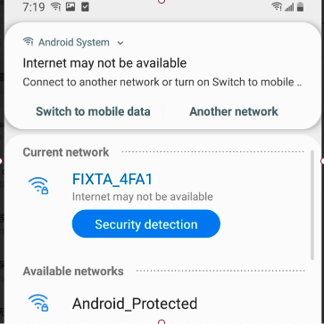

# Wi-Fi Setup Methods

# Summary

As the first step to setup any IoT devices, the UE for this step can be simplified to 2 words: simple, steady. Any other design is unnecessary. Currently we suppliy these following methods:

| Name           | Description                                                  |
| :--------      | :----------------------------------------------------        |
| WAC (iOS only) | If your device supports Airplay2, you can use this way       |
| BLE            | If your model supports BLE, we recommend you to use this way |
| SoftAP         | If your model doesn't support BLE, you can use this          |

# WAC
WAC, Wireless Accessory Configuration, is introduced by Apple in [2013](https://developer.apple.com/videos/play/wwdc2013/700/) which used to configure Wi-Fi product. You need to join Apple MFi program and implement specific hardware in your embedded device.

The benefit of this method is that user can connect the device to the iPhone's connected AP directly without entering password. The flow is like this:

# Why we recommend BLE instead of SoftAP

In short:

1. App can't discover the un-setup devices around (not like BLE), app can only use tooltip text to lead user to setup the device.

2. There're some cases that app can't decide if the device is setup successfully. In contrary, BLE setup can know clearly what the result is, if it's success or fail, the reason for the failure is password incorrect, protocol issues or others. SoftAP setup can't get the clearly result, actually when the connect command has sent out, then the app starts to guess what the state of the device is.

3. When Android phone connects to device's hotspot, the system would make a misleading alert which would interrupt our setup process and we can't do anything about it.

More details:

- Can't notify user the unpaired devices around

    

    If using BLE, the app can tell user "Found new device xxx";
    But if we use softAP to setup device, we can only using sentences like "Open your phone settings and tap on Wi-F, tap on xxx and come back to this app"; and we have to tell the user to confirm that Wi-Fi indicator blinks which means the device is in setup mode

- When Android phone connected to the device's AP, it'll pop up an alert which would mislead the user

    

    You can see there're 2 options, "Switch to mobile data" and "Another network". We have many customer complains about this, because customer may not know clearly what this means and chooses one of them, then the setup process would be interrupt. 

    

- Device tries to connect to router, app disconnects from device, the system enters an uncertain state.

    

    Now the device is in an unknown state:

    - Success

        

    - There're multiple AP around, and bridge together

        

        Maybe device and phone are not in same router, they still can contact with each other. Success.

    - Password incorrect, or other reasons,  anyway device doesn't connect to router successfully

        

        Phone disconnects from the device, and connects to a router around randomly. After timeout the phone can't discover the device, fail.

    - There're multiple AP around and isolate

        

        App can't discover the device, timeout and fail.
