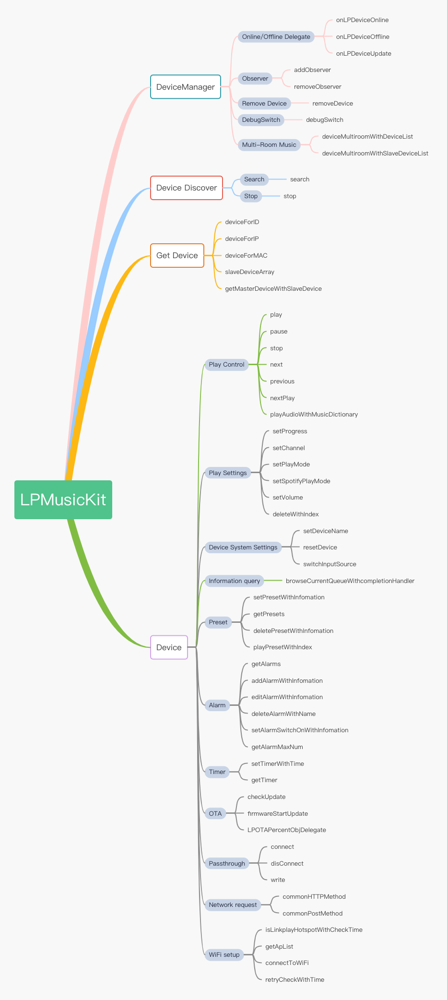

# 设备发现

# Overview 

设备管理包含了，设备的上线、下线、删除等操作，同时也可以通过Id来获取到对应的设备, LPDeviceManager 提供了管理设备的API




# API Reference 

### 设备搜索

#### 搜索设备
- 接口说明

    搜索周边的设备
    
    ``` ObjectiveC
    - (void)start:(NSString *)searchKey;
    ```

- 参数

| 名称      | 类型                     | 接口说明                                                   |
| :--------| :----------------------- | :---------------------------------------------------- |
| key      | NSString                 | 默认传空，客户如有自定义组播搜索设备关键字则传入              |

- 返回值

    无

- 示例代码

    ``` ObjectiveC
    [[LPDeviceManager sharedInstance] search:@""];
    ```

#### 停止搜索设备

- 接口说明

    ``` ObjectiveC
    - (void)stop;
    ```

- 参数

    无

### 添加代理

#### 添加观察者

- 接口说明

    ``` ObjectiveC
    - (void)addObserver:(id<LPDeviceManagerObserver>)observer;
    ```

- 参数

| 名称     | 类型                     | 接口说明                                               |
| -------- | ----------------------- | ---------------------------------------------------- |
| observer | LPDeviceManagerObserver | 要接收设备上下线通知的对象                                |

- 返回值

    无

- 示例代码

    ``` ObjectiveC
    [[LPDeviceManager sharedInstance] addObserver:self];
    ```

#### 移除观察者

- 接口说明

    ``` ObjectiveC
    - (void)removeObserver:(id<LPDeviceManagerObserver>)observer;
    ```

- 参数

| 名称      | 类型                    | 接口说明                                          |
| -------- | ----------------------- | ----------------------------------------------  |
| observer | LPDeviceManagerObserver | 要接收设备上下线通知的对象                           |

- 返回值

    无

- 示例代码

    ``` ObjectiveC
    [[LPDeviceManager sharedInstance] removeObserver:self];
    ```

### 获取设备

#### 根据设备Id获取设备

- 接口说明

    ``` ObjectiveC
    - (LPDevice *)deviceForID:(NSString *)UUID;
    ```

- 参数

| 名称       | 类型                      | 接口说明                                          |
| :-------- | :----------------------- | :----------------------------------------------  |
| UUID      | NSString                  | 设备UUID                                         |

- 返回值

| 类型               | 接口说明                                  |
| :-----------------| :--------------------------------------- |
| LPDevice          | 设备对象                                  |


- 示例代码

    ``` ObjectiveC
    LPDevice *device = [[LPDeviceManager sharedInstance] deviceForID:UUID];
    ```

#### 获取主设备列表

- 接口说明

    ``` ObjectiveC
    - (NSArray<LPDevice *> *)getMasterDevices;
    ```
- 参数

    无

- 返回值

| 类型               | 接口说明                                  |
| :-----------------| :--------------------------------------- |
| NSArray<LPDevice> | 主设备列表                                 |

- 示例代码

    ``` ObjectiveC
    self.deviceListArray = [[LPDeviceManager sharedInstance] getMasterDevices];
    ```

#### 根据设备IP获取设备

- 接口说明

    ``` ObjectiveC
    - (LPDevice *)deviceForIP:(NSString *)IP;
    ```

- 参数

| 名称       | 类型                      | 接口说明                                          |
| :-------- | :----------------------- | :----------------------------------------------  |
| IP        | NSString                 | 设备IP                                            |

- 返回值

| 类型               | 接口说明                                  |
| :-----------------| :--------------------------------------- |
| LPDevice          | 设备对象                                  |


- 示例代码

    ``` ObjectiveC
    LPDevice *device = [[LPDeviceManager sharedInstance] deviceForIP:IP];
    ```

#### 根据设备MAC获取设备

- 接口说明

    ``` ObjectiveC
    - (LPDevice *)deviceForMAC:(NSString *)MAC;
    ```

- 参数

| 名称       | 类型                      | 接口说明                                          |
| :-------- | :----------------------- | :----------------------------------------------  |
| MAC       | NSString                 | 设备MAC                                           |


- 返回值

| 类型               | 接口说明                                  |
| :-----------------| :--------------------------------------- |
| LPDevice          | 设备对象                                  |

- 示例代码

    ``` ObjectiveC
    LPDevice *device = [[LPDeviceManager sharedInstance] deviceForIP:MAC];
    ```

#### 根据主设备Id获取子设备列表

- 接口说明

    ``` ObjectiveC
    -(NSArray<LPDevice *> *)slaveDeviceArray:(NSString *)UUID;
    ```

- 参数

| 名称       | 类型                      | 接口说明                                          |
| :-------- | :----------------------- | :----------------------------------------------  |
| UUID      | NSString                  | 设备UUID                                         |


- 返回值

| 类型               | 接口说明                                  |
| :-----------------| :--------------------------------------- |
| NSArray<LPDevice> | 子设备列表                                 |

- 示例代码

    ``` ObjectiveC
    NSArray *slaveListArray = [[LPDeviceManager sharedInstance] slaveDeviceArray:UUID];
    ```

#### 子设备获取其主设备

- 接口说明

    ``` ObjectiveC
    -(LPDevice *)getMasterDeviceWithSlaveDevice:(LPDevice *)device;
    ```

- 参数

| 名称       | 类型                      | 接口说明                                          |
| :-------- | :----------------------- | :----------------------------------------------  |
| device      | LPDevice               | 设备                                             |

- 返回值

| 类型               | 接口说明                                  |
| :-----------------| :--------------------------------------- |
| LPDevice          | 设备对象                                  |

- 示例代码

    ``` ObjectiveC
        // The result may be empty
        LPDevice *masterDevice = [[LPDeviceManager sharedInstance] getMasterDeviceWithSlaveDevice:slaveDevice];
    ```

#### App Log输出开关

- 接口说明

    ``` ObjectiveC
    - (void)debugSwitch:(BOOL)logOn;
    ```

- 参数

| 名称       | 类型                      | 接口说明                                          |
| :-------- | :----------------------- | :----------------------------------------------  |
| logOn      | BOOL                  | log开关                                         |


- 返回值

    无

### 删除设备

#### 删除设备

- 接口说明

    ``` ObjectiveC
    - (void)removeDevice:(NSString *)UUID;
    ```

- 参数

| 名称       | 类型                      | 接口说明                                          |
| :-------- | :----------------------- | :----------------------------------------------  |
| UUID      | NSString                  | 设备UUID                                         |

- 返回值

    无

- 示例代码

    ``` ObjectiveC
    [[LPDeviceManager sharedInstance] removeDevice:UUID];
    ```

### 设备上下线代理

- LPDeviceManagerObserver

| 名称                | 类型      | 接口说明                       |
| :----------------- | :-------- | :--------------------------- |
| onLPDeviceOnline   | LPDevice  | 设备上线                       |
| onLPDeviceOffline  | LPDevice  | 设备下线                       |
| onLPDeviceUpdate   | LPDevice  | 设备更新                       |


#### - (LPDevicePlayer *)getPlayer;

- 接口说明

    Get Device's player.

- 参数

    无

- 返回值

| 类型           | 接口说明   |
| -------------- | ------------- |
| LPDevicePlayer | Player object |

#### - (LPDevicePreset *)getPreset;

- 接口说明

    Get Preset object

- 参数

    无

- 返回值

| 类型           | 接口说明   |
| -------------- | ------------- |
| LPDevicePreset | Preset object |

#### - (LPDeiceAlarm *)getAlarm;

- 接口说明

    Get alarm object

- 参数

    无

- 返回值

| 类型          | 接口说明  |
| ------------- | ------------ |
| LPDeviceAlarm | Alarm object |

#### - (LPDeviceTimer *)getTimer;

- 接口说明

    Get shutdown timer object

- 参数

    无

- 返回值

| 类型          | 接口说明           |
| ------------- | --------------------- |
| LPDeviceTimer | Shutdown timer object |

#### - (LPPassthrough *)getPassthrough;

- 接口说明

    Get pass through object

- 参数

    无

- 返回值

| 名称 | 类型          | 接口说明               |
| ---- | ------------- | ------------------- |
| mcu  | LPPassThrough | Pass through object |

#### - (LPDeviceOTA *)getOTA;

- 接口说明

    Get OTA object

- 参数

    无

- 返回值

| 类型        | 接口说明      |
| ----------- | ----------- |
| LPDeviceOTA | OTA object  |

#### 属性

| 名称       | 类型           | 接口说明                |
| ---------- | -------------- | -------------------- |
| player     | LPDevicePlayer | Player object        |
| preset     | LPDevicePreset | Preset object        |
| status     | LPDeviceStatus | Device status object |
| alarm      | LPDeviceAlarm  | Alarm object         |
| timer      | LPDeviceTimer  | Timer object         |
| mediaInfo  | LPMediaInfo    | Media info object    |
| deviceInfo | LPDeviceInfo   | Device info object   |


## 设备当前信息和查询
### LPDeviceInfo 
  设备播放的当前信息和查询

### 属性 

| 名称        | 类型     | 接口说明                     |
| ------------------| -------- | ------------------- |
| playStatus        | NSString | Current play status |
| playMode          | int      | Play mode           |
| mediaType         | NSString | Media Type          |
| trackSource       | NSString | Track source        |
| ...               | ...      | ...                 |

 - currentQueue
    
    当前正在播放的歌单queue名称，需要调用updateCurrentPlayInfo或browserQueue方法，才会赋值
 - currentPlayIndex

    当前播放歌曲在当前播放歌单中的索引，需要调用updateCurrentPlayInfo或browserQueue方法，才会赋值

### 方法

#### 更新当前播放信息

- 接口说明

    设置当前的显示设备或切换当前的显示设备，您需要调用此方法一次。 可用于更新deviceInfo中的currentQueue和currentPlayIndex的值位

    ```ObjectiveC
    - (void)updateCurrentPlayInfo
    ```
- 参数

    N/A

- 返回值

    N/A

- 示例代码

    ``` ObjectiveC
    [device.deviceInfo updateCurrentPlayInfo];
        
    ```

#### Browse Queue

- 接口说明

    查询设备信息，获得的结果可以通过[[LPMDPKitManager shared] getBrowseListWithString：result] 转换数据结构

    ``` ObjectiveC
    - (void)browseQueue:(NSString *_Nullable)queueName skipContent:(BOOL)skip completionHandler:(LPBrowseBlock _Nullable)completionHandler;
    ```

- 参数

| 名称           | 类型         | 接口说明                                                                                |
| :------------ | :------------| :------------------------------------------------------------------------------------  |
| queueName     | NSString     | 值是 @"TotalQueue", @"CurrentQueue", @"USBDiskQueue" 或者歌单的queue 名称                 |
| skip          | BOOL         | 默认值是 NO                                                                      |

- 返回值

    无

- 示例代码

    ``` ObjectiveC
    [device.deviceInfo browseQueue:@"CurrentQueue" skipContent:NO completionHandler:^(id  _Nullable obj, NSString * _Nullable resultString) {
        NSLog(@"currentQueue = %@", device.deviceInfo.currentQueue);
        NSLog(@"currentPlayIndex = %d", device.deviceInfo.currentPlayIndex);
        LPPlayMusicList *musicListObj = [[LPMDPKitManager shared] getBrowseListWithString:resultString];
    }];
    ```

## LPMediaInfo

### 方法 

    无

### 属性 

| 名称   | 类型     | 接口说明 |
| ------ | -------- | ----------- |
| title  | NSString | Title       |
| artist | NSString | Artist      |
| album  | NSString | Album       |
| ...    | ...      | ...         |


## LPDeviceStatus 

### 方法

    无

### 属性 

| 名称         | 类型     | 接口说明               |
| ------------ | -------- | ---------------------- |
| UUID         | NSString | UUID                   |
| IP           | int      | IP                     |
| WiFiStrength | float    | Wi-Fi signal strength  |
| MAC          | NSString | MAC                    |
| SSID         | NSString | SSID                   |
| friendlyName | NSString | Device's friendly name |
| version      | NSString | Firmware version       |
| language     | int      | Prompt tone language   |
| release      | NSString | Compiled date          |


## Other Definitions

### LPPlayMode

| 类型             | 接口说明       |
| ---------------- | -------------- |
| LP_LISTREPEAT    | Loop playback  |
| LP_SINGLEREPEAT  | Single cycle   |
| LP_SHUFFLE       | Shuffle        |
| LP_SHUFFLEREPEAT | Shuffle repeat |
| LP_DEFAULT       | Default        |

### LPSpotifyPlayMode

| 类型                             | 接口说明           |
| -------------------------------- | --------------------- |
| LP_SPOTIFY_LISTREPEAT            | Loop playback         |
| LP_SPOTIFY_SINGLEREPEAT          | Single cycle          |
| LP_SPOTIFY_SHUFFLEREPEAT         | Shuffle repeat        |
| LP_SPOTIFY_SHUFFLE               | Shuffle               |
| LP_SPOTIFY_DEFAULT               | Default               |
| LP_SPOTIFY_SINGLE_REPEAT_SHUFFLE | Shuffle single repeat |


### LPDeviceChannel

| 类型             | 接口说明   |
| ---------------- | ------------- |
| LPChannel_stereo | Stereo        |
| LPChannel_left   | Left channel  |
| LPChannel_right  | Right channel |


### LPPlayStatus

| 类型                             | 接口说明      |
| -------------------------------- | ---------------- |
| LP_PLAYER_STATE_PLAYING          | Playing          |
| LP_PLAYER_STATE_STOPPED          | Stop             |
| LP_PLAYER_STATE_PAUSED_PLAYBACK  | Pause            |
| LP_PLAYER_STATE_TRANSITIONING    | Transitioning    |
| LP_PLAYER_STATE_NO_MEDIA_PRESENT | No media present |


### LPRoomState

| 类型           | 接口说明    |
| -------------- | -------------- |
| LP_ROOM_MASTER | Master speaker |
| LP_ROOM_SLAVE  | Slave speaker  |


### LPMediaObj

| 类型        | 接口说明 |
| ----------- | ----------- |
| title       | 名称        |
| mediaID     | Server ID   |
| serverIndex | index       |

