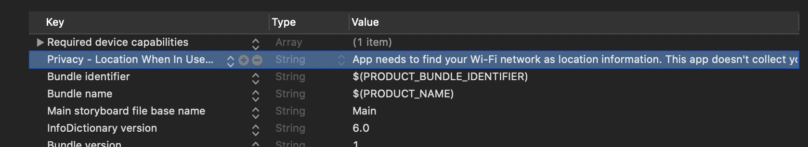
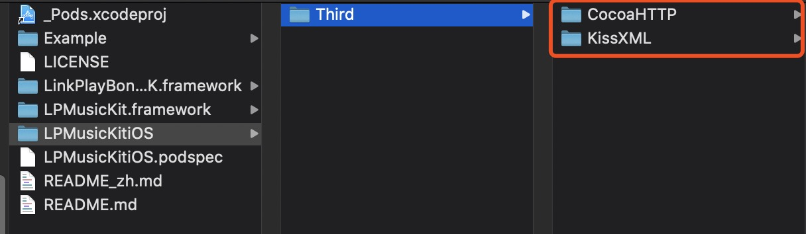
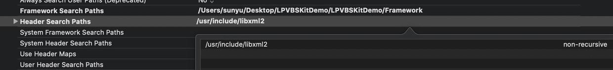

# 集成 SDK

建议您使用CocosPods 集成SDK，当然您也可以下载SDK并手动配置项目以使用它。

### 1.集成LPMusicKitSDK

Linkplay Music Kit是Linkplay Home Audio方案的app端SDK；通过它，您可以快速的将我们的解决方案实现到您的产品里。

MusicKit主要解决了两方面的问题：

维护与固件的通讯协议，使您可以简洁的与设备进行交互而不必关心琐碎的通讯技术问题

封装了网络服务（音乐服务、智能语音服务等）的复杂度，使您可以快速接入它们而不必关心实现细节

#### 1.使用 CocoaPods 快速集成（ SDK 最低支持系统版本 10.0）

- 在 `Podfile` 文件中添加对应的SDK地址进行集成，如集成设备SDK：

```ruby
platform :ios, '10.0'

target 'your_target_name' do

   pod "LPMusicKitiOS", :git => "https://github.com/linkplayapp/LPMusicKitiOS.git"

end
```
然后在项目根目录下执行 `pod update` 命令进行集成。

_CocoaPods 的使用请参考：[CocoaPods Guides](https://guides.cocoapods.org/)_
_CocoaPods 建议更新至最新版本_

- 申请Wi-Fi 权限

- iOS13申请定位权限, Info.plist 文件中添加 NSLocationWhenInUseUsageDescription


#### 2.手动配置项目
- [下载 LPMusicKitiOS](https://github.com/linkplayapp/LPMusicKitiOS/archive/master.zip)
- 导入 LPMusicKit.framework、LinkPlayBonjourSDK.framework两个Framework

- 导入AFNetworking 和 LPMusicKitiOS/Third 中的三方库

- Build Settings, 设置 Other Linker Flags 的值为  -ObjC

- Header Search Paths: 添加 /usr/include/libxml2 路径

- 申请Wi-Fi 权限

- iOS13申请定位权限, Info.plist 文件中添加 NSLocationWhenInUseUsageDescription


以下是LinkPlay 各个SDK的地址：


[LPMusicKitiOS SDK](https://github.com/linkplayapp/LPMusicKitiOS):

pod "LPMusicKitiOS", :git => "https://github.com/linkplayapp/LPMusicKitiOS.git"

[LPBLESetupiOS SDK](https://github.com/linkplayapp/LPBLESetupiOS):

pod "LPBLESetupiOS", :git => "https://github.com/linkplayapp/LPBLESetupiOS.git"

[LPAlexaKitiOS SDK](https://github.com/linkplayapp/LPAlexaKitiOS):

pod "LPAlexaKitiOS", :git => "https://github.com/linkplayapp/LPAlexaKitiOS.git"

[LPMSNASiOS SDK](https://github.com/linkplayapp/LPMSNASiOS):

pod "LPMSNASiOS", :git => "https://github.com/linkplayapp/LPMSNASiOS.git"

[LPMSMediaLibraryiOS SDK](https://github.com/linkplayapp/LPMSMediaLibraryiOS):

source 'https://github.com/linkplayapp/LPSpecsiOS.git'
source 'https://github.com/CocoaPods/Specs.git'

target 'your_target_name' do

   pod "LPMSMediaLibraryiOS", :git => "https://github.com/linkplayapp/LPMSMediaLibraryiOS.git"

end

然后在项目根目录下执行 `pod update` 命令进行集成。

_CocoaPods 的使用请参考：[CocoaPods Guides](https://guides.cocoapods.org/)_
_CocoaPods 建议更新至最新版本_

### 1.使用 CocoaPods 快速集成（ SDK 最低支持系统版本 10.0）