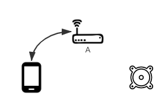
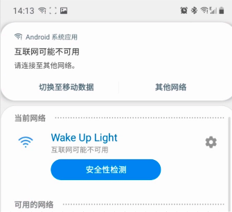

# Wi-Fi配网方式

# 简介

作为所有物联网设备使用前的第一步，这一步的用户体验最重要的就是四个字：简单、稳定。任何花里胡哨的设计都是多余的。目前我们提供了以下几种方式：

| 名称           | 说明                                                  |
| :--------      | :---------------------------------------------------- |
| WAC (iOS only) | 如果您的设备支持Airplay2，可以使用此种方式           |
| BLE配网        | 如果您的模组有BLE模块，则可以使用此种配网方式         |
| 直连配网       | 如果您的模组没有BLE模块，可以使用此种方式             |

# WAC
WAC, Wireless Accessory Configuration, 是苹果在[2013](https://developer.apple.com/videos/play/wwdc2013/700/)年就引入的用于无线产品配置的一个技术。您需要加入Apple MFi program并且在您的设备里内置指定芯片才可以使用。

它的好处是用户可以将设备直接连接到iPhone所连接的路由器上而不需要用户输入路由器密码。它的流程大概是这样的：

# 为什么我们推荐BLE配网而不是直连配网

简单来说：

1. 无法发现周围有未处于配网状态的设备，只能用软性的提示文字告知用户

2. 有可能无法明确的判断设备是否成功连接。相比较来说，BLE可以明确直到最后的结果，是成功、失败，失败原因是密码不正确、参数错误、协议不支持？直连无法得到准确结果，发完连接指令就开始猜，猜最后的结果是什么。

3. Android直连的时候，系统会有误导用户的提示造成配网失败

详细描述：

- 无法明确提示用户有未setup的设备

    

    如果是BLE，可以明确告知用户“找到新设备xxx”；
    如果是直连，只能提示用户“请在手机的Wi-Fi列表中连接到Soundbar5.1_xxx上”；如果设备未处于配网状态，还需要提示用户“请长按xx键，直到设备上的xx灯开始闪烁”

- Android手机在直连时，会提示当前网络不可用

    

    只有两个选项，“切换至移动数据”和“其他网络”。很多用户点了其中一个，直连流程就中断了

    

- 设备尝试连接路由器，app与设备断开连接

    

    此时处于一种未知状态:

    - 成功

        
        
    - 家中有多个Wi-Fi，并且桥接

        

        此时虽然双方不在同一个路由器下，仍然可以发现设备，成功

    - 密码错误，或其他原因，设备没有连到路由器上

        

        手机从设备断开，随机连接上一个以前连接的Wi-Fi。超时未发现设备，失败

    - 家中有多个Wi-Fi，没有关系

        

        发现不了，超时失败
